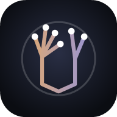

<p align="center">
  
</p>

<h1 align="center">Gesture Synth</h1>

<p align="center">
  A chord instrument you play with your hands in front of a camera.<br>
  Loop it. Watch the harmony.
</p>

<p align="center">
  <a href="https://github.com/Londopy/gesture-synth/actions/workflows/ci.yml"></a>
  <a href="https://github.com/Londopy/gesture-synth/actions/workflows/release.yml"></a>
  <a href="CHANGELOG.md"></a>
  <a href="https://github.com/Londopy/patchnotes"></a>
  <a href="https://keepachangelog.com/en/1.1.0/"></a>
  <a href="https://semver.org"></a>
</p>

<p align="center">
  <a href="https://github.com/Londopy/gesture-synth/releases/latest"></a>
  <a href="https://github.com/Londopy/gesture-synth/releases"></a>
  <a href="https://github.com/Londopy/gesture-synth/commits/main"></a>
  <a href="https://github.com/Londopy/gesture-synth/issues"></a>
  <a href="https://github.com/Londopy/gesture-synth/pulls"></a>
  <a href="https://github.com/Londopy/gesture-synth/stargazers"></a>
  <a href="https://github.com/Londopy/gesture-synth"></a>
  <a href="LICENSE"></a>
</p>

<p align="center">
  
  
  
  
  
  
  
  
  
  
  
  
  
</p>

<p align="center">
  
  
  
  
  
  
  
  
  
</p>

---

Left hand picks the chord: scale degree from which fingers are up, major or
minor from the palm tilt. Right hand shapes it: inversion, sevenths, octave
with the thumb, filter with tilt, volume with height. A loop pedal records
gesture performances into four tracks against a metronome. Everything you play
is drawn back at you as a harmony-aware scene: wireframe hands, a note
constellation, the circle of fifths, audio-reactive particles, and translucent
ghost hands replaying your loops.

It ships as a **Tauri desktop app** (native audio thread, MIDI out, ffmpeg
export) and as a **web app** at the same URL structure (installable PWA,
offline after first load), from one codebase. Sessions are byte-identical on
both, so a loop made in the browser opens on desktop and vice versa.

## Quick start

```bash
git clone https://github.com/Londopy/gesture-synth.git
cd gesture-synth
npm install
npm run models     # MediaPipe runtime + hand landmark model (7.8 MB)
npm run dev        # http://localhost:5173
```

Click **Start**, allow the camera, hold both hands up side by side with palms
toward the camera. Index finger up on the left hand plays **I**. Press `H` for
the gesture cheat sheet, `R` to record a loop.

Desktop:

```bash
node scripts/fetch-ffmpeg.mjs   # optional: mp4 export sidecar
npm run tauri:dev               # or: npm run tauri:build
```

## How you play

| Left hand | Chord degree | Right hand | Shape |
| --- | --- | --- | --- |
| index | I | 1 finger | triad |
| index + middle | II | 2 fingers | first inversion |
| index + middle + ring | III | 3 fingers | seventh (maj7 / m7) |
| four fingers | IV | 4 fingers | dom7 on major, m7b5 on minor |
| all five | V | thumb folded / out | octave down / up |
| index + pinky | VI | tilt inward / outward | filter open / closed |
| index + pinky + thumb | VII | hand height | volume |
| fist | mute | pinch | arpeggiator (height = rate) |
| tilt inward / outward | major / minor | | |

Views: `C` cycles **performance** (wireframe only), **practice** (your hands
under a dark tint) and **clear camera** (the plain picture, no effects).
`Ctrl/Cmd+Shift+R` opens the **recorder**: scene or raw camera, instrument
audio, optional microphone, saved as webm or mp4.

Extras: flick the left hand toward the camera for a bass note, touch both fists
and rotate to change key around the circle of fifths, hold still for two
seconds to latch the chord. `Tab` switches to **Theremin** mode (right height =
pitch, left height = volume). Simplified schemes (scale-only, fixed degree,
fixed style, dynamics only) live in the top-left menu.

## What is in the box

| Path | What | Language |
| --- | --- | --- |
| `crates/gsyn-core` | gesture parser, chord model, synth, sample-accurate transport, event-stream loop pedal, `.gsyn.json` formats, MIDI + SMF, engine | Rust |
| `crates/gsyn-wasm` | wasm-bindgen surface: parser on the main thread, engine in an AudioWorklet | Rust |
| `crates/gsyn-zig` | SIMD DSP kernel (oscillators, SVF, mixing, soft clip), linked with `--features zig` | Zig |
| `app` | Svelte 5 + Three.js frontend, PWA, exports, pages | TypeScript |
| `src-tauri` | Tauri 2 shell: cpal audio thread, midir MIDI, data folder, ffmpeg sidecar, `gsyn://` links | Rust |
| `services/community` | accounts, uploads, likes, comments, remix chains, short links | Gleam |
| `content` | sample songs, instrument and theme files | JSON |

Pages: **Play**, **Learn** (song tutorials with ghost target outlines and a
timing + shape score), **Song Builder** (type `ii7 V7 Imaj7` or click degrees,
generate a tutorial or drop it into a track), **Instruments** (live preset
editor), **Visuals** (five themes), **Community**, **Settings**.

Exports: `.session.gsyn.json`, `.mid` (one track per loop), `.wav` (offline
bounce), `.webm` clip (scene + audio, metronome excluded), `.mp4` (ffmpeg
sidecar on desktop, ffmpeg.wasm in cross-origin-isolated browsers).

## Architecture in one paragraph

The camera feeds MediaPipe Hand Landmarker in the webview. Landmarks go to the
Rust gesture parser, which produces a `MusicalState` plus one-shot events.
Exactly one producer owns each slot: the parser owns the live slot, the loop
engine owns the four track slots. The synth and the renderer are pure
consumers. On desktop the state crosses to a native cpal audio thread through
a lock-free triple buffer; in the browser it crosses to an AudioWorklet through
a SharedArrayBuffer ring (postMessage fallback without cross-origin isolation).
Loops are stored as timestamped events and 100 Hz parameter curves, not audio,
so instruments can change after recording and files stay tiny.

## Requirements

| Tool | Version | Needed for |
| --- | --- | --- |
| Rust | 1.85+ and `rustup target add wasm32-unknown-unknown` | everything |
| Node | 20+ | app, scripts |
| Zig | 0.16 | optional `zig` kernel feature |
| Gleam + Erlang | 1.18 / OTP 27+ | community service |
| ffmpeg | any | optional mp4 export |
| Tauri prerequisites | | desktop build ([docs](https://v2.tauri.app/start/prerequisites/)) |

## Download instead of building

Every [release](https://github.com/Londopy/gesture-synth/releases) has Windows
(.msi) and Linux (.AppImage, .deb) installers (macOS: build from source, see
[DEPLOY.md](DEPLOY.md)), a zip of the
website you can run on your own computer with one command (`node serve.mjs`,
then open http://localhost:4173), `SHA256SUMS.txt` to verify downloads, and an
install tutorial in the release notes. The notes are generated from
[CHANGELOG.md](CHANGELOG.md) by [patchnotes](https://pypi.org/project/patchnotes/),
which also validates the changelog in CI and publishes the changelog badge above.
`npm run serve` runs the same local server against your own build.

## Hosting the web build

Cross-origin isolation gives the app SharedArrayBuffer (lower latency, mp4 in
the browser):

```
Cross-Origin-Opener-Policy: same-origin
Cross-Origin-Embedder-Policy: require-corp
```

`app/public/_headers` (Netlify, Cloudflare Pages) and `app/vercel.json` set
them. Without them the app still runs with one camera frame of extra latency
and webm-only export.

Community service: `cd services/community && gleam run` (in-memory store on
`:8787`), or with `DATABASE_URL` for Postgres. See its
[README](services/community/README.md).

## Tests

```bash
npm test                                   # core + frontend
cargo test -p gsyn-core --features zig     # against the Zig kernel
cd crates/gsyn-zig && zig build test       # kernel + parity with the Rust reference
cd services/community && gleam test        # 23 HTTP tests
```

No camera? In the browser console,
`window.__gsyn.synth(leftMask, rightMask, leftTilt, rightTilt, rightY)` feeds
synthetic hands through the whole pipeline.

## Keyboard

`Space` play/stop · `R` record · `1-4` track · `M`/`S` mute/solo ·
`Delete` clear · `Tab` theremin · `[`/`]` key · `-`/`=` BPM · `Esc` panic ·
`F` performance view · `C` view mode · `G` grid · `H` help · `Ctrl/Cmd+Shift+R` record video · `Ctrl/Cmd+S` save · `Ctrl/Cmd+E` export

## Contributing

Read [CONTRIBUTING.md](CONTRIBUTING.md). Changes are logged in
[CHANGELOG.md](CHANGELOG.md) (Keep a Changelog, validated with
[patchnotes](https://pypi.org/project/patchnotes/)). Security issues follow
[SECURITY.md](SECURITY.md). Everyone here follows the
[Code of Conduct](CODE_OF_CONDUCT.md).

## License

[MIT](LICENSE) © 2026 Londopy
